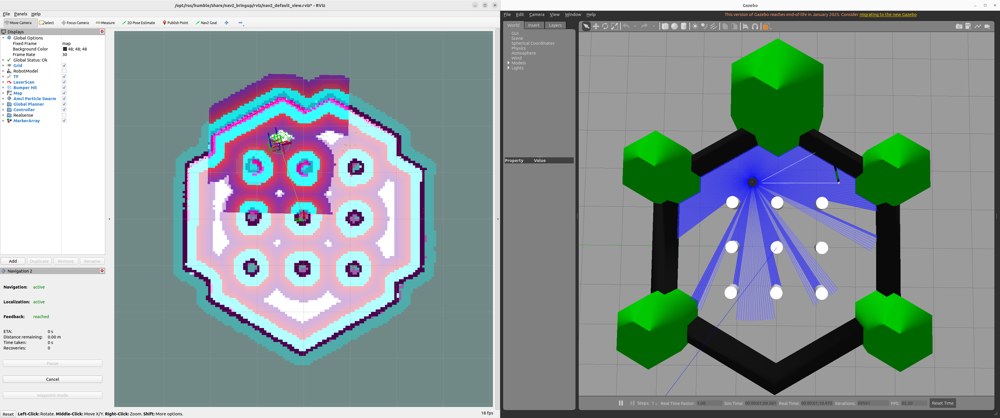

# SLAM & Nav2 튜토리얼 (ROS 2 Humble + TurtleBot3 Gazebo)

최종 업데이트: 2026-02-06

TurtleBot3 Gazebo(시뮬레이션)에서 아래 Flow들을 직접 실행하며
SLAM / Localization / Nav2가 각각 어떤 책임을 갖는지 “손으로” 익히는 것을 목표로 합니다.

## Flow Definitions (Precise Terminology)

### **Flow A — Offline SLAM–based Map Construction + AMCL-based Navigation**
*(Pre-built Map Navigation / Localization-based Navigation)*

- SLAM을 **사전에 한 번 수행**하여 정적 맵을 생성
- 주행 단계에서는 **SLAM을 사용하지 않음**
- **AMCL**을 이용해 localization 수행
- **Nav2**를 사용한 목표 기반 주행

**핵심 정의**  
> SLAM is used only for map construction, not during navigation.

---

### **Flow B — Online SLAM–based Mapping with Post-mapping Navigation**
*(Online SLAM with Post-mapping Navigation)*

- **slam_toolbox**로 실시간 SLAM 수행
- 생성된 맵을 저장
- 저장된 맵을 이용해
  - **AMCL + Nav2**로 정적 맵 기반 주행

**핵심 정의**  
> SLAM is active only during the mapping phase.

---

### **Flow C — Online SLAM–based Autonomous Navigation**
*(SLAM-based Navigation / Navigation under SLAM)*

- **SLAM이 주행 전 과정에서 활성**
- **Nav2**가 SLAM이 생성하는 `/map`을 직접 사용
- Goal 기반 **완전 자율 주행**
- Localization과 Mapping이 **동시에 수행**

**핵심 정의**  
> Navigation is performed under continuously evolving maps and poses.

---

## 0) 준비물

### 환경
- Ubuntu + ROS 2 Humble
- TurtleBot3 Gazebo (Gazebo Classic)

### 패키지 설치

```bash
sudo apt update
sudo apt install -y \
  ros-humble-navigation2 \
  ros-humble-nav2-bringup \
  ros-humble-turtlebot3-gazebo \
  ros-humble-slam-toolbox \
  ros-humble-turtlebot3-teleop
```

### 공통 환경 설정 — 모든 터미널

```bash
source /opt/ros/humble/setup.bash
export TURTLEBOT3_MODEL=waffle
export GAZEBO_MODEL_PATH="${GAZEBO_MODEL_PATH}:/opt/ros/humble/share/turtlebot3_gazebo/models"
```

---

## 1) Flow A — Offline SLAM–based Map Construction + AMCL-based Navigation

### 목적
- 정적 맵을 로드하고, AMCL을 수렴시킨 뒤, Nav2 Goal로 목표점까지 주행합니다.

### 1-1. Gazebo 월드 실행
- 터미널 1:
  ```bash
  ros2 launch turtlebot3_gazebo turtlebot3_world.launch.py
  ```

### 1-2. Nav2 Bringup 실행 (AMCL 기반 Localization)
- 터미널 2:
  ```bash
  ros2 launch nav2_bringup bringup_launch.py \
    use_sim_time:=True \
    autostart:=True \
    map:=$(pwd)/map/turtlebot3_world.yaml
  ```

### 1-3. RViz 실행 (Nav2 기본 뷰)
- 터미널 3:
  ```bash
  ros2 run rviz2 rviz2 -d "$(ros2 pkg prefix --share nav2_bringup)/rviz/nav2_default_view.rviz"
  ```

### 1-4. RViz에서 할 일
1. 2D Pose Estimate → 초기 위치 지정 (AMCL 수렴 필수)
2. Nav2 Goal → 목표점 지정
3. 로봇이 경로 계획 후 목표점까지 주행하는지 확인

### 1-5. 상태/동작 검증 (선택)

```bash
ros2 topic list | egrep "amcl|map|tf|cmd_vel|clock"
ros2 run tf2_tools view_frames
rqt_graph
```

---

## 2) Flow B — Online SLAM–based Mapping with Post-mapping Navigation

### 목적
- Online SLAM으로 맵을 생성하고 저장한 뒤, 저장한 맵으로 AMCL + Nav2 주행까지 수행합니다.

### Phase 1 — Mapping (Online SLAM)
> 이 Phase에서는 Nav2를 실행하지 않습니다. 목적은 “지도 생성”입니다.

### 2-1. Gazebo 실행
- 터미널 1:
  ```bash
  ros2 launch turtlebot3_gazebo turtlebot3_world.launch.py
  ```

### 2-2. slam_toolbox 실행 (Online Async)
- 터미널 2:
  ```bash
  ros2 launch slam_toolbox online_async_launch.py use_sim_time:=True
  ```

### 2-3. 키보드 텔레옵으로 주행
- 터미널 3:
  ```bash
  ros2 run turtlebot3_teleop teleop_keyboard
  ```

권장 주행 방식:
- 큰 원을 그리며 주행
- 벽을 따라 이동
- 회전만 반복하지 말 것

### 2-4. RViz 실행 및 SLAM 확인
- 터미널 4:
  ```bash
  ros2 run rviz2 rviz2
  ```

RViz 설정:
- Fixed Frame: `map`
- Displays:
  - Map (`/map`)
  - LaserScan (`/scan`)
  - TF
  - RobotModel (선택)

### 2-5. 상태/동작 검증 (선택)

```bash
ros2 topic echo /clock --once
ros2 topic hz /map
ros2 topic list | egrep "slam|map|scan|tf"
```

### 2-6. 맵 저장

```bash
ros2 run nav2_map_server map_saver_cli -f ~/my_map
```

결과 확인:

```bash
ls -al ~/my_map.*
```

### Phase 2 — Post-mapping Navigation (Saved map + AMCL + Nav2)
> 주의: slam_toolbox(SLAM)와 AMCL(Localization)을 동시에 켜면 `map → odom` TF가 충돌할 수 있습니다.  
> Phase 1의 `slam_toolbox`는 종료한 뒤 아래를 진행하세요.

### 2-7. Nav2 Bringup 실행 (AMCL)
- 터미널 2:
  ```bash
  ros2 launch nav2_bringup bringup_launch.py \
    use_sim_time:=True \
    autostart:=True \
    map:=$HOME/my_map.yaml
  ```

### 2-8. RViz 실행 (Nav2 기본 뷰)
- 터미널 3:
  ```bash
  ros2 run rviz2 rviz2 -d "$(ros2 pkg prefix --share nav2_bringup)/rviz/nav2_default_view.rviz"
  ```

### 2-9. RViz에서 할 일
1. 2D Pose Estimate → 초기 위치 지정 (AMCL 수렴 필수)
2. Nav2 Goal → 목표점 지정
3. 로봇이 경로 계획 후 목표점까지 주행하는지 확인

---

## 3) Flow C — Online SLAM–based Autonomous Navigation

### 목적
- slam_toolbox가 실시간으로 생성하는 `/map`을 사용하면서, Nav2 Goal 기반 자율 주행을 동시에 수행합니다.

> 포인트: 이 Flow는 정적 맵을 로드하지 않으며, SLAM이 제공하는 `map → odom`을 그대로 사용합니다.

### 3-1. Gazebo 실행
- 터미널 1:
  ```bash
  ros2 launch turtlebot3_gazebo turtlebot3_world.launch.py
  ```

### 3-2. slam_toolbox 실행 (Online Async)
- 터미널 2:
  ```bash
  ros2 launch slam_toolbox online_async_launch.py use_sim_time:=True
  ```

### 3-3. Nav2 Navigation 실행 (Map 없이, SLAM 기반)
- 터미널 3:
  ```bash
  ros2 launch nav2_bringup navigation_launch.py use_sim_time:=True autostart:=True
  ```

> 주의:
> - `bringup_launch.py` ❌
> - `navigation_launch.py` ⭕

이 구성에서는 정적 맵을 로드하지 않으며,
Nav2는 SLAM이 퍼블리시하는 `/map`을 그대로 사용합니다.

### 3-4. RViz 실행 (SLAM + Nav2 확인)
- 터미널 4:
  ```bash
  ros2 run rviz2 rviz2
  ```

RViz 설정:
- Fixed Frame: `map`
- Displays:
  - Map (`/map`)
  - TF
  - LaserScan (`/scan`)
  - RobotModel
  - Path (Nav2)

### 3-5. RViz에서 할 일
1. 2D Pose Estimate → (필요 시) 초기 pose 지정
2. Nav2 Goal → 목표점 지정
3. 로봇 동작 확인
   - SLAM을 통해 지도가 지속적으로 확장되는지 확인
   - 동시에 Nav2가 경로 계획을 수행하는지 확인
   - 로봇이 목표점까지 자율 주행하는지 확인

### 3-6. 상태/동작 검증 (선택)

```bash
ros2 topic list | egrep "slam|map|scan|tf|cmd_vel|clock"
ros2 run tf2_tools view_frames
rqt_graph
```
### 3-7. 맵 저장

```bash
ros2 run nav2_map_server map_saver_cli -f ~/my_map
```


---

## 4) 개념 요약 (핵심 정리)

- **SLAM**
  - 맵과 로봇 포즈를 동시에 추정하는 문제 (지도 생성 단계의 핵심)
- **AMCL**
  - 이미 존재하는 맵 위에서 로봇 위치를 추정 (정적 맵 주행 단계의 핵심)
- **Nav2**
  - 목표점까지의 경로 계획과 제어를 담당하는 내비게이션 스택

핵심 구분:
- 지도 생성 단계 → SLAM
- 정적 맵 기반 주행 → AMCL + Nav2
