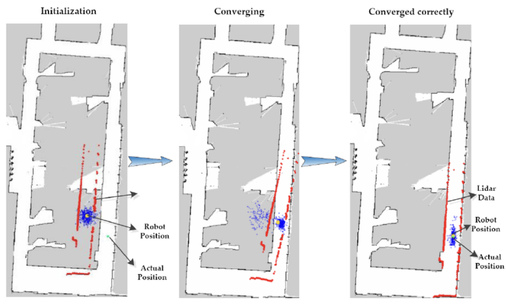

# AMCL이란 무엇인가? (Adaptive Monte Carlo Localization)

> 함께 읽기: [Nav2](what_is_nav2.md), [SLAM](what_is_slam.md)

## 한 줄 요약
**AMCL**은 “**이미 만들어진 지도(map)가 있을 때**” 라이다/오도메트리 정보를 이용해
로봇의 위치(`map` 좌표에서의 pose)를 추정하는 **파티클 필터(몬테카를로) 기반 로컬라이제이션** 알고리즘입니다.

---

## AMCL은 언제 쓰나?
AMCL은 보통 아래 조건에서 가장 잘 맞습니다.

- **정적 맵(Occupancy Grid)이** 이미 있음 (예: `map.yaml` + `map.pgm`)
- 라이다(/scan)와 오도메트리(/odom)가 있고, TF가 정상적으로 이어짐
- “지도를 만드는 것”보다 “지도 위에서 위치를 아는 것”이 목적

이 저장소의 **Map-based Navigation** 파트가 딱 AMCL의 대표 사용 사례입니다. (`README.md` 참고)

---

## 핵심 아이디어(파티클 필터를 아주 친절하게)
AMCL의 “믿음(belief)”은 하나의 점이 아니라 **여러 개의 가설(파티클)로** 표현됩니다.

1) **예측(Prediction)**: 바퀴가 이렇게 굴렀으니(오도메트리), 파티클들도 대충 이만큼 움직였겠지  
2) **측정 업데이트(Update)**: 지금 라이다가 본 벽/장애물 모양이, 지도에서 그 위치라면 “말이 되나?”를 점수로 매김  
3) **리샘플링(Resample)**: 점수 높은 파티클을 더 많이 남기고, 낮은 파티클은 버림  
4) **추정(Estimate)**: 살아남은 파티클들의 평균/최빈 등으로 현재 pose를 계산

### “Adaptive”가 의미하는 것
환경이 단순하면 파티클을 적게 써도 되고, 복잡/불확실하면 더 많이 필요합니다.  
AMCL은 대표적으로 **KLD-sampling** 같은 방식으로 파티클 수를 상황에 맞게 조절해 성능과 속도를 균형 잡습니다.

---

## ROS 2 / Nav2에서 AMCL은 무엇을 만들어내나?
내비게이션 관점에서 AMCL이 해주는 가장 중요한 일은 **TF 하나**입니다.

- AMCL은 **`map → odom` 변환**을 추정해서 브로드캐스트합니다.
- 오도메트리는 보통 `odom → base_link`를 제공합니다.
- 그러면 전체적으로 `map → base_link`가 성립하고, Nav2가 전역 위치를 알 수 있습니다.

### 자주 보는 토픽(대표)
- 구독: `/scan`, `/tf`, `/tf_static`, (RViz가 보내는) `/initialpose`
- 발행: `/amcl_pose`, `/particlecloud`(설정에 따라), `/tf`의 `map → odom`

---

## RViz에서 꼭 해야 하는 것: 초기 위치(Initial Pose)
AMCL은 “내가 지도에서 어디쯤”인지를 모르는 상태로 시작할 수 있습니다.
이때 RViz의 **2D Pose Estimate**로 초기 pose를 찍어주면, 파티클이 그 주변으로 모이며 빠르게 수렴합니다.

> “로봇을 다른 곳으로 옮겼는데(키드냅) 다시 위치를 못 잡는다” 같은 상황도 결국 초기화 문제로 이어집니다.

---

## 파라미터를 어떻게 바라보면 좋나? (외우기보다 구조)
AMCL을 튜닝할 때는 크게 네 묶음으로 나눠 생각하면 편합니다.

1) **프레임/토픽 연결**: `base_frame_id`, `odom_frame_id`, `global_frame_id`, `scan_topic`  
2) **파티클 수/적응**: `min_particles`, `max_particles`, (KLD 관련 파라미터)  
3) **업데이트 주기**: `update_min_d`, `update_min_a` (움직임이 이만큼 생기면 업데이트)  
4) **센서 모델**: `laser_model_type`, 빔/노이즈 관련 파라미터

튜닝은 “파티클을 늘리면 정확도는 오르지만 컴퓨팅 성능이 더 든다” 같은 트레이드오프가 항상 존재합니다.

---

## 자주 겪는 문제(체크리스트)
- **TF가 끊김**: `map → odom → base_link`가 이어지는지 먼저 확인  
- **라이다 프레임 불일치**: `/scan`의 `frame_id`와 TF 트리가 일치하는지 확인  
- **맵이 이상하게 보임**: `map.yaml`의 resolution / origin, 좌표계 방향이 맞는지 확인  
- **초기 위치 미설정**: RViz에서 2D Pose Estimate를 찍지 않으면 수렴이 매우 느리거나 실패 가능  
- **오도메트리 드리프트 과다**: 바퀴 미끄러짐/슬립이 심하면 AMCL이 계속 흔들릴 수 있음

---

## 참고 자료
- ROS Wiki AMCL: https://wiki.ros.org/amcl
- Nav2 문서(로컬라이제이션/bringup 관련): https://docs.nav2.org/
- 교과서(권장): *Probabilistic Robotics* (Thrun, Burgard, Fox) — 파티클 필터/로컬라이제이션의 정석
